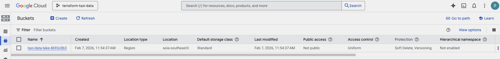
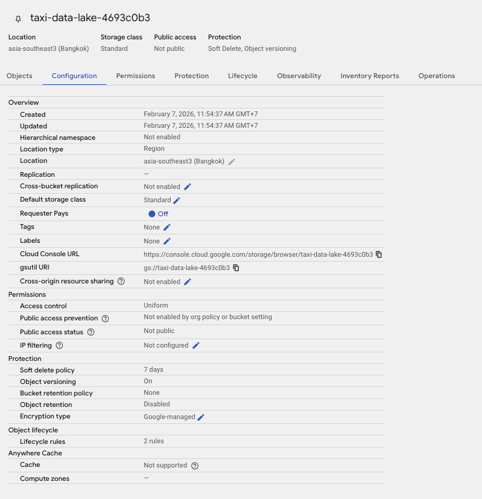
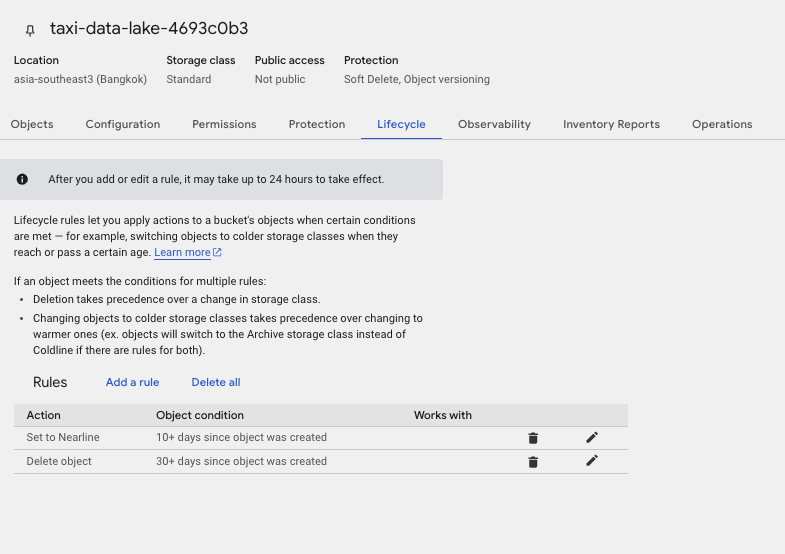
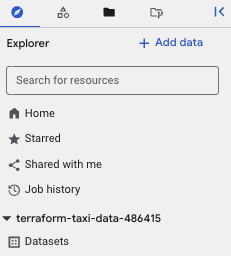

# Terraform GCP - Taxi Data Project

Learn how to use Terraform to provision GCP cloud services for a data engineering project.

## Why Terraform?

As a data engineer, setting up cloud services (storage buckets, databases, policies) for each new project is repetitive. Doing it manually via the GCP console or CLI makes it hard to version control and reproduce across environments (dev, sit, prod).

Terraform (Infrastructure-as-Code) solves this by defining infrastructure in declarative config files that can be versioned, reviewed, and reused.

## Prerequisites

1. A GCP project with billing enabled
2. A Service Account with **Storage Admin** and **BigQuery Admin** roles
3. A service account key (JSON) downloaded to `credentials/`
4. [Terraform CLI](https://developer.hashicorp.com/terraform/downloads) installed
5. Familiarity with GCS basics - recommended reading: [Google Cloud Storage blog](https://cloud-ace.co.th/blogs/f7z3s8-google-cloud-storage)

## Project Structure

```
.
├── main.tf                    # Provider config + resource definitions
├── variables.tf               # Variable declarations + locals
├── terraform.tfvars           # Actual variable values (gitignored)
├── terraform.tfvars.example   # Template for terraform.tfvars
├── credentials/               # Service account keys (gitignored)
└── .gitignore
```

## Getting Started

### 1. Set up credentials

```bash
cp terraform.tfvars.example terraform.tfvars
```

Edit `terraform.tfvars` with your project ID and credentials path.

### 2. Initialize Terraform

```bash
terraform init
```

Downloads provider plugins (Google, Random) and prepares the working directory.

### 3. Preview changes

```bash
terraform plan
```

Shows the diff between current state and desired state (e.g. +2 resources to create).

### 4. Apply

```bash
terraform apply
```

Provisions the resources on GCP.

### 5. Destroy (when done)

```bash
terraform destroy
```

Removes all resources defined in the config.

## What Gets Provisioned

| Resource | Name | Description |
|---|---|---|
| GCS Bucket | `taxi-data-lake-<random>` | Data lake with lifecycle rules (STANDARD -> NEARLINE after 10d, delete after 30d) |
| BigQuery Dataset | `taxi_dataset` | Dataset with 90-day table/partition expiration |

## Key Concepts Learned

- **4 Building Blocks**: `terraform {}`, `provider {}`, `resource {}`, `variable {}`/`locals {}`
- **4 Core Commands**: `init`, `plan`, `apply`, `destroy`
- **Best Practices**: Variables for reusable values, `sensitive = true` for credentials, `locals` for computed constants, `.gitignore` for state/secrets

## Result

After `terraform apply`, GCS appears like this:





Meanwhile, BQ appears like this


## What's Next

- [ ] Use `terraform.workspace` to manage multiple environments (dev/prod)
- [ ] Move state to a remote backend (GCS bucket) for team collaboration
- [ ] Add `output.tf` to export resource attributes (bucket name, dataset ID)
- [ ] Modularize resources into reusable Terraform modules
- [ ] Set up CI/CD pipeline to run `terraform plan` on PR and `apply` on merge

## Reference

- [Understanding Terraform Fundamentals by Zainabmosunmola](https://zainabmosunmola.medium.com/understanding-terraforms-fundamentals-a0eac0d8c9ed)
[GCS Terraform](https://registry.terraform.io/providers/hashicorp/google/latest/docs/resources/storage_bucket)
[Bigquery Dataset Terraform](https://registry.terraform.io/providers/hashicorp/google/latest/docs/resources/bigquery_dataset)
[Bigquery Table Terraform](https://registry.terraform.io/providers/hashicorp/google/latest/docs/resources/bigquery_table)

